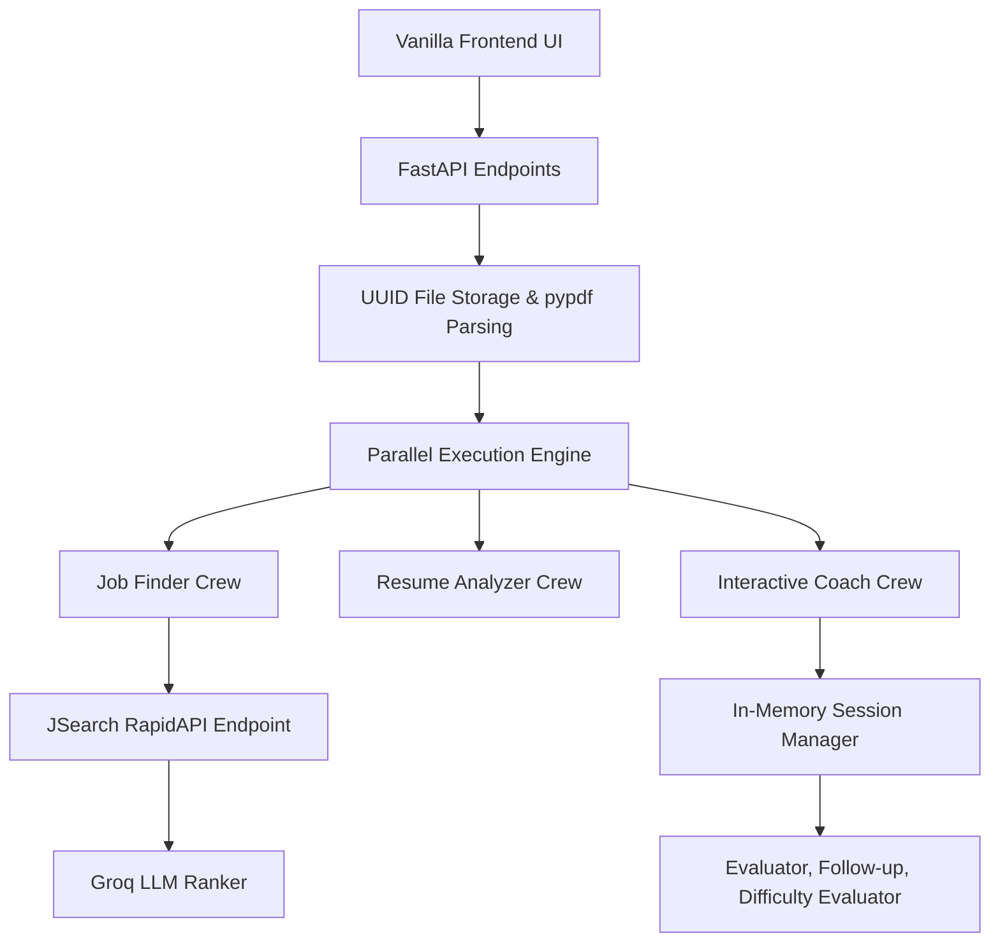

# Jobify.ai – AI Career Assistant (Copilot Edition)

Jobify is a full-stack AI-powered career assistant that analyzes resumes, maps out user preferences, suggests **real** job opportunities via live API searches, optimizes resumes dynamically, and features a **Stateful, Real-Time Interactive Interview Coach**. The entire system runs on a highly-optimized, multi-agent CrewAI backend.

---

## 🔥 Key Features

### 1. Real-Time "Zero Hallucination" Job Search (Hybrid RAG)
- Uses the **JSearch API (RapidAPI)** to fetch live, structured job postings before the LLM runs.
- **Phase 1: Inference** — LLM identifies the 5 best-fit roles based on your uploaded resume and UI preferences.
- **Phase 2: Retrieval** — Fetches live job listings with deduplication strictly tied to Company/Title/Location.
- **Phase 3: RAG Ranking** — LLM scores, ranks, and filters ONLY the live fetched data (guaranteeing 0 hallucinated jobs).

### 2. Multi-Agent Resume Optimization
- **Resume Analyzer**: Deeply evaluates the parsed PDF, scoring it and flagging specific ATS issues across Experience, Skills, and Projects.
- **Resume Rewriter**: Identifies passive or weak bullet points and rewrites them to be highly actionable, quantified, and ATS-friendly (strictly clamped to avoid hallucinating false achievements).

### 3. Stateful Interactive Interview Coach (The Socratic Loop)
- **Dynamic Difficulty**: Modulates the interview difficulty (1 to 10 scale) based on your performance.
- A **3-Agent Loop** evaluates your answers:
  - **Interviewer**: Asks the question strictly targeted at your inferred level and resume weaknesses.
  - **Evaluator**: Grades your typed response providing a score out of 10, highlighting Strengths, Missing Concepts, and Technical Depth.
  - **Follow-up Coach**: Pivot dynamically if you struggle or pushes you deeper into system design if you excel.

### 4. Performance & Scalability Design
- Built on `FastAPI` with asynchronous endpoints.
- Agents execute **concurrently** via a Python ThreadPool engine mapping independent agents across CPUs.
- Auto-retries (429 handling) with exponential backoff designed specifically for LLM API rate limits.
- UI features clean Vanilla JS, CSS3, with state tracked efficiently bypassing standard refresh barriers.

---

## 💻 Tech Stack

### Backend
- **Python 3.10+**
- **FastAPI / Uvicorn**
- **CrewAI** (Multi-Agent System)
- **Groq LLMs** (Llama 3.3 70B & 3.1 8B Instant)

### Application APIs
- **JSearch API** via RapidAPI (Retrieves live LinkedIn/Google jobs data natively)

### Frontend
- **HTML5, CSS3, Vanilla JavaScript** (Zero bloated frameworks, instantaneous load times)

---

## 🚀 Getting Started

### 1. Clone the Repository
```bash
git clone https://github.com/Advaith4/JOBIFY.git
cd JOBIFY
```

### 2. Set Up Virtual Environment
```bash
# Initialize
python -m venv venv

# Windows
venv\Scripts\activate

# macOS/Linux
source venv/bin/activate
```

### 3. Install Dependencies
```bash
pip install -r requirements.txt
```

### 4. Configure Environment Variables
Create a `.env` file in the root directory (see `.env.example`):
```
GROQ_API_KEY=your_groq_api_key_here
RAPIDAPI_KEY=your_rapidapi_key_here
```
1. Get a free API key at: [console.groq.com](https://console.groq.com)
2. Subscribe to JSearch API for free at [rapidapi.com](https://rapidapi.com/letscrape-6bRBa3QGz9/api/jsearch)

### 5. Run the Application
```bash
uvicorn app:app --reload
```
Open your browser to: **http://127.0.0.1:8000**

---

## 📌 Architecture Overview



## ⚖️ Built By
Designed and iteratively engineered with a focus on eliminating standard LLM chat-wrapper architectures through rigid State Machines and strictly bound Multi-Agent constraints.